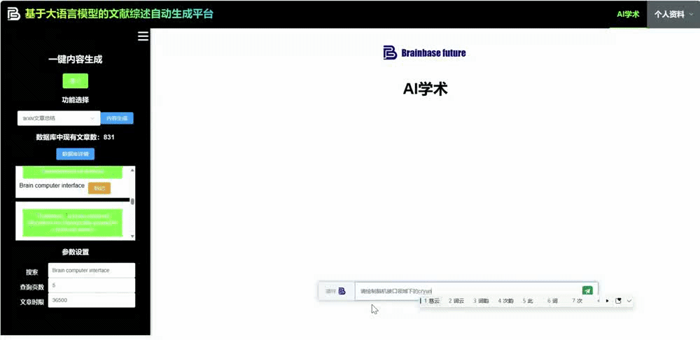
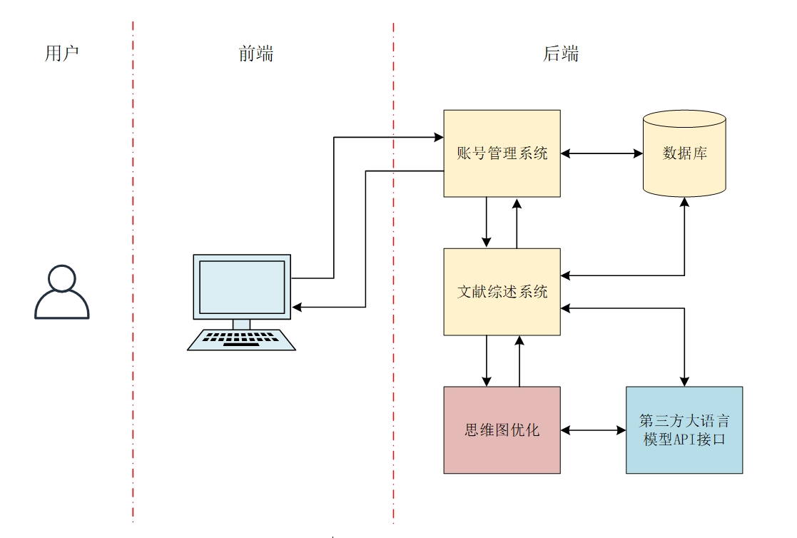

# ChatBrain AI Academic Assistant V2.0 

<div style="font-size: 1.5rem;">
  <a href="./README.md">中文</a> |
  <a href="./readme_en.md">English</a>
</div>
</br>

This project has received:

* **Xunfei "Spark Cup" Cognitive Large Model Scene Innovation Competition:** National Third Prize (Top 8)
* **2023 Huawei Developer Contest:** National Third Prize

And as one of the products in the BrainBase Future - Leading the Era of Brain-Machine Interface Education Application Matrix, it won the **First Prize** in the 9th China International "Internet+" College Student Innovation and Entrepreneurship Competition Beijing Division.

**Feature Overview**

Version 2.0 features include three main modules: Paper Database Plus, AI Data Statistics, and AI Summary Generation.

1. Paper Database Plus:

    * Utilizes AI for retrieving information from all research papers.
    * Summarizes, translates, and saves each paper in the database.


2. AI Data Statistics
    * Performs statistical analysis on the frequency of keywords.
    * Generates word clouds and frequency histograms.
    * Illustrates the first occurrence of keywords over time and their cumulative frequencies.


3. AI Summary Generation
    * Based on the Xunfei Spark large model.
    * Utilizes the AI Agent tool to generate summaries with a single click in a specific domain.



## System Architecture



This system is divided into six major functional modules:

1. Frontend Pages:

    * Directory: ./BrainBaseFuture_Team/vue
2. Account Management System:

    * Directory: ./BrainBaseFuture_Team
3. Literature Review System:

    * Directory: ./chat_server
4. Graph of Thought Optimization Algorithm System:

    * Note: Relevant research results have not been published; details are temporarily undisclosed.
5. Database System:

    * Uses MySQL database
6. LLM Interface Management:

    * Directory: ./chat_server

The directory paths corresponding to each module have been provided. You can use this information to locate the specific implementations and related files for each module in the file system.

## Install

The frontend pages are built using VUE3, the account management system is constructed with the Go language, and the literature review system utilizes Python.

### Frontend Pages
Please install Node.js v16.17.0 on your own.

To start the service, use the following commands:

```
cd ./BrainBaseFuture_Team/vue
npm run dev
```

### Account Management System
Please install go1.21.0 + on your own.

To start the service, use the following commands:

```
cd ./BrainBaseFuture_Team
go run main.go route.go
```

### Literature Review System
Please configure the Python 3.8+ environment on your own.

Use the following commands to install Python packages:

```
cd ./chat_server
pip install -r requirements.txt
```

Replace the server IP address with the actual deployed IP:

```
SERVER_ADDRESS = ''  # Replace with your IP address
```

To start the service, use the following commands:

```
cd ./chat_server
python main.py
```

### Graph of Thought Optimization Algorithm System

Not disclosed at the moment.

### Database System
Using MySQL database.

You can load the database with ./chat_server/bbft.sql.

Note: Translated Markdown documents and original PDF literature are stored at local absolute paths. The code package for this is not provided temporarily.

### LLM Interface Management

To use the Spark model, you need to configure the API key in the respective locations in the following two files:

./chat_server/SparkApi_none_stream.py
./chat_server/SparkWS.py

## Quick Start

This application is deployed to the public network.

Visit http://119.3.238.159:5173/

Test account: nxyqdl@163.com

Password: 123456

## Citations

If you find this repository valuable, please give it a star!

Please cite the repo if you use the data or code in this repo.

```
@misc{ChatBrain,
  author={Xinyu Ning, Guanglong Zhang, Yutong Zhao, Di Zhou},
  title = {ChatBrain: A Literature Review Automatic Generation Platform Based on LLM.},
  year = {2023},
  publisher = {GitHub},
  journal = {GitHub repository},
  howpublished = {\url{https://github.com/JayceNing/ChatBrain}},
}
```

## Comments

* The code for the paper summarization part of this project is mainly built on the foundation of [ChatPaper](https://github.com/kaixindelele/ChatPaper). Thanks for the open source contribution!